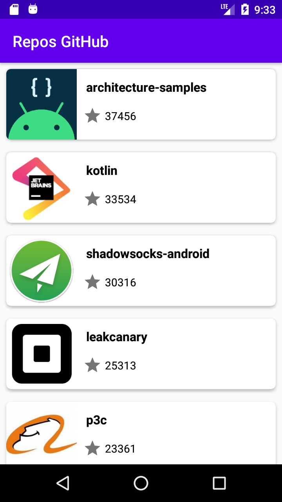
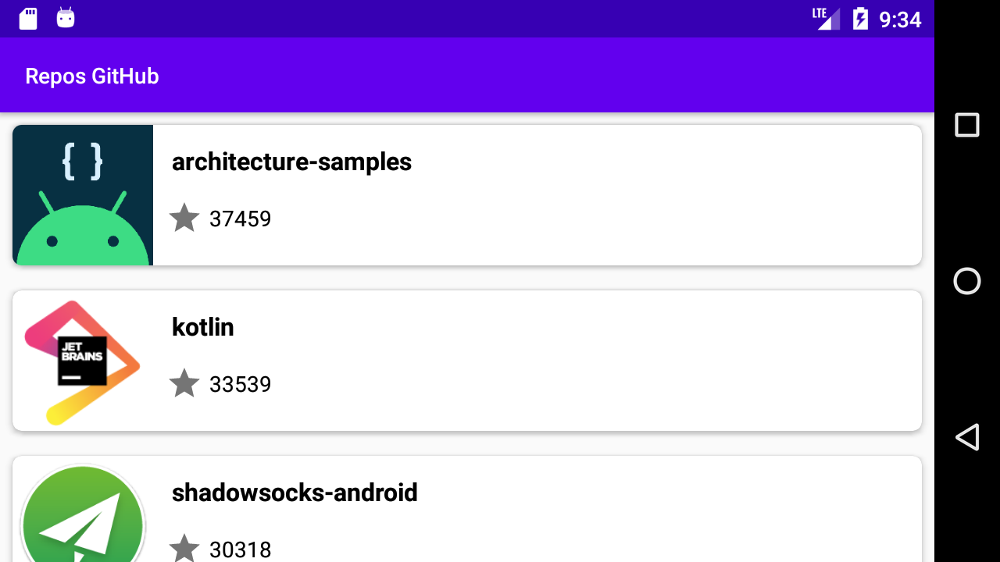
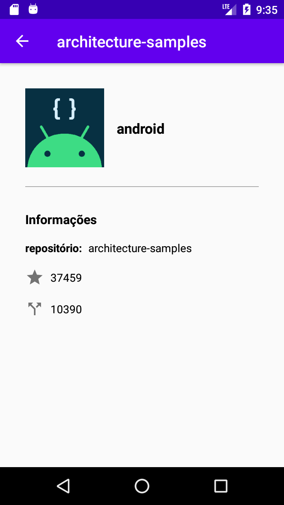

# Desafio Android:

<p align="center">
  
  
  
</p>
<a name="flow" />

1. [Introdução](#introduction)
2. [Requisitos](#requirements)
3. [Arquitetura](#architecture)
4. [Recursos](#resources)
5. [Considerações](#considerations)
5. [Instalação](#setup)
6. [Licença](#license)
<a name="introduction" />

## Introdução

Desafio proposto para a vaga de desenvolvedor Android. De acordo com o teste, você deve fazer um aplicativo que liste os repositórios usando a linguagen Kotlin mais favoritados.
<a name="requirements" />

## Requisitos:

Obrigatórios:
- Lista de Repositórios
- Exemplo de chamada: https://api.github.com/search/repositories?q=language:kotlin&sort=stars&page=1
- Exibir nome do repo, quantidade de estrelas, quantidade de fork, foto e nome do autor
- Scroll infinito
- Testes unitários

Opcionais:
- Kotlin
- Android Architecture Components
- Testes de UI usando Espresso
- Rx ou Coroutines
- Cache de imagens e da API
- Suportar mudanças de orientação das telas sem perder o estado
<a name="architecture" />

## Arquitetura

A arquitetura utilizada foi a MVVM (Model View ViewModel), separados por features com 3 camadas: repository, viewmodel e ui.

<p align="center">
  
</p>

<a name="resources" />

## Recursos

 - Kotlin
 - Androidx
 - MVVM e LiveData
 - Architecture Components
 - Retrofit
 - Moshi
 - Serializable
 - Glide
 - DataBinding e ViewBinding
 - Coroutines
 - Koin
 - Junit e Mockito
 - Expresso
<a name="considerations" />

## Considerações

1 item obrigatório + 1 item opcional, eu não consegui fazer. São eles: scroll infinito e cache de imagens e API.
<a name="setup" />

## Instalação

Para rodar esse projeto, faça um clone do repositório na sua máquina.
Faça o build da aplicação utilizando Android Studio ou via terminal com ```./gradlew assembleDebug```
<a name="license" />

## Licença
<aside class="notice">

Copyright 2019 Ricardo Sousa

Licensed under the Apache License, Version 2.0 (the "License");
you may not use this file except in compliance with the License.
You may obtain a copy of the License at

    http://www.apache.org/licenses/LICENSE-2.0

Unless required by applicable law or agreed to in writing, software
distributed under the License is distributed on an "AS IS" BASIS,
WITHOUT WARRANTIES OR CONDITIONS OF ANY KIND, either express or implied.
See the License for the specific language governing permissions and
limitations under the License.

</aside>
